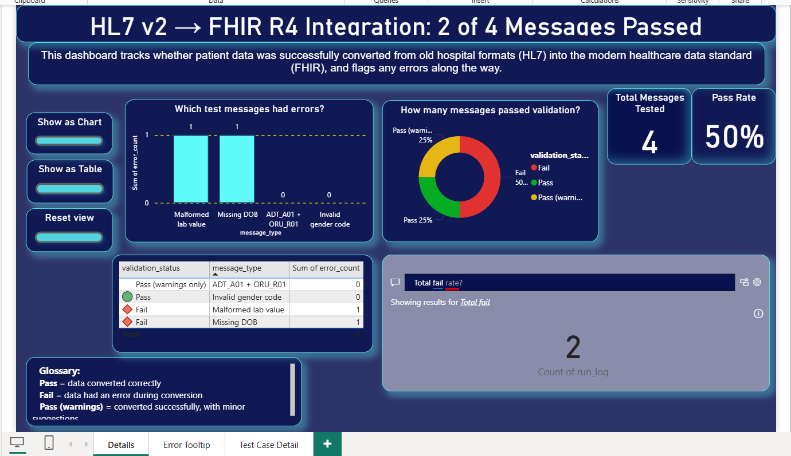

   # HL7 v2 to FHIR R4 Transformation & Validation Engine

   A Python pipeline that transforms legacy HL7 v2 clinical messages 
   (ADT admissions, ORU lab results) into US Core-conformant FHIR R4 
   resources, validates them, pushes them to a live FHIR server, and 
   visualizes governance metrics in an interactive Power BI dashboard.

   ## Dashboard
   

   ## What this project does
   - Parses HL7 v2 ADT and ORU messages
   - Builds FHIR R4 Patient, Encounter, and Observation resources
   - Validates against the US Core Implementation Guide
   - Posts to a live HAPI FHIR test server and verifies persistence
   - Tracks validation outcomes in an interactive governance dashboard

   ## Tech used
   Python, hl7, fhir.resources, Jupyter, Power BI

   See the full project report for architecture details, challenges 
   solved, and results.
